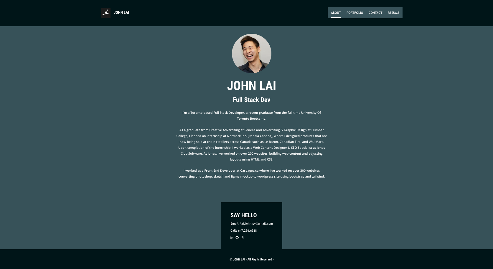

# John Lai's React Portfolio

## User Story
As an employer looking for candidates with experience building single-page applications. I want to view a potential employee's deployed React portfolio of work samples so that I can assess whether they're a good candidate for an open position

## Description
* This is John Lai a Full Stack Developer's portfolio site.

* This project uses Tailwind and custom scss for styling. It is a single page React portfolio.

## Table of Contents
- [Installation](#installation)
- [Usage](#usage)
- [How to Contribute](#how-to-contribute)
- [Questions](#questions)
- [License](#license)

## Installation
* N/A
## Usage
* In the root directory run npm start to get it to work locally.
To push and display final layout in staging or in production, run npm deploy.

* This project uses React, react-app, tailwin and gh-pages

## License
* This project is under the MIT license.
* If you want to get more details about the license, please visit [Choose License](https://choosealicense.com "Choose License")

## How to Contribute
* Feel free to contact via email or github or fork my repo and request for pull request!

## Tests
* N/A

## Questions
* Please contact me via my [Github Username](https://github.com/johnxlai)

* You can reach me with additional questions <a href="mailto:lai.john.py@gmail.com">lai.john.py@gmail.com</a>

# Screenshot

## Live Site
https://johnxlai.github.io/react-portfolio/#about

## Repo
https://github.com/johnxlai/react-portfolio

